# Sphaire architecture

Sphaire is a Next.js application with a browser-resident modeling workspace. Exact and
mesh geometry are produced through WebAssembly-backed engines, rendered with
Babylon.js, and coordinated through Zustand stores. Server routes are used for
provider calls and optional integrations, not as the primary geometry kernel.

## System diagram

```mermaid
flowchart LR
    user["Designer"] --> studio["Studio UI"]
    studio <--> state["Zustand state"]
    state --> viewport["Babylon.js viewport"]
    studio --> builder["Enhanced builder"]

    builder --> classifier["Prompt classifier"]
    classifier -->|"Parametric"| codegen["CAD code generation"]
    classifier -->|"Organic"| meshgen["Optional mesh generation"]
    memory["Local or pgvector memory"] --> builder

    codegen --> sandbox["Static scan and bounded execution"]
    sandbox --> kernels["OpenCascade or Replicad WASM"]
    kernels --> mesh["Mesh and construction code"]
    meshgen --> mesh

    mesh --> validator["Manifold geometry validation"]
    validator --> dfm["Deterministic DFM checks"]
    dfm --> vision["Optional visual review"]
    vision -->|"Correction requested"| codegen
    vision -->|"Accepted or skipped"| state
    dfm -->|"Best effort with review notes"| state

    state --> inspector["Inspector and edit tools"]
    inspector --> state
    state --> exporter["Exporters"]

    provider["OpenAI-compatible API or Ollama"] --> codegen
    provider --> vision
```

## Runtime boundaries

| Boundary | Responsibilities |
| --- | --- |
| Browser UI | Studio layout, selection, transforms, edit tools, materials, progress |
| Browser geometry | OpenCascade/Replicad execution, tessellation, Babylon.js rendering |
| Deterministic verification | Mesh validity, build volume, wall, feature, overhang, degeneracy checks |
| Next.js API routes | Protect server keys, normalize provider calls, optional mesh services |
| Optional persistence | Browser local storage by default; pgvector/Supabase when configured |
| External providers | Chat, vision, embeddings, and optional organic mesh generation |

## Creation lifecycle

The command bar calls `enhancedBuild(request, options)` in
`services/pipeline/enhancedBuilder.ts`.

1. **Classify** — `organicClassifier` chooses the parametric or organic route.
2. **Retrieve** — generation memory can provide relevant proven examples.
3. **Plan** — known objects may use deterministic templates; other requests use the
   configured provider to produce backend-specific construction code.
4. **Screen and execute** — generated code passes a static safety scan and bounded
   execution before reaching OpenCascade or Replicad.
5. **Validate** — Manifold checks the resulting triangle mesh when available.
6. **Review DFM** — pure geometry rules evaluate the selected FDM, SLA, or CNC profile.
7. **Review visually** — optional rendered views are evaluated against the request.
8. **Correct or return** — actionable findings can produce another bounded pass;
   verified templates and exhausted attempts return their built geometry with notes.
9. **Commit** — mesh data, code, parameters, and metadata enter the central store and
   become visible to the inspector, editor, and exporters.

Every asynchronous review stage has a deadline. Optional systems should return a
skipped result instead of preventing a valid geometry result from reaching the store.

## State and rendering

`store/store.ts` is the logical document: it owns shapes, selection IDs, transforms,
parametric metadata, and undo/redo-facing updates. `store/sceneStore.ts` owns live
Babylon scene references such as selected render meshes and lights.

`components/ViewportProduction.tsx` keeps those worlds synchronized:

- store shape → render mesh creation or update;
- canvas pick → logical shape selection;
- gizmo drag → transform update;
- edit mode → topology selection on a real renderable child mesh;
- model hierarchy → one logical imported object with multiple renderable surfaces.

This separation is important. A GLB container may have no geometry itself, while its
children are pickable and material-bearing. Tools should resolve logical selection to
the correct renderable targets rather than assuming one shape equals one Babylon mesh.

## Provider architecture

All AI features call `services/providers/llmProvider.ts`, which exposes:

- `chat` for CAD code and corrections;
- `vision` for optional rendered-result critique;
- `embed` for generation memory.

OpenAI-compatible requests use `pages/api/llm.ts`, keeping a server-configured key out
of browser bundles. A BYO key is stored in browser settings and forwarded only for the
selected provider call. Ollama is contacted directly at the configured local endpoint.

Provider calls, screenshot capture, visual review, code correction, and overall
creation all have deadlines so the UI can recover from an unavailable service.

## Determinism and trust boundary

Generation is probabilistic; acceptance criteria are not.

- Generated code is untrusted input.
- Static screening blocks obvious network, DOM, dynamic import, and evaluation paths.
- CAD execution has a wall-clock budget, though synchronous WASM work must still be
  kept bounded by construction.
- Geometry validity and DFM are deterministic functions of mesh data and profile.
- Visual review can suggest corrections but cannot certify manufacturability.
- A best-effort result is clearly labeled and remains the user's decision to keep.

## Imports, materials, and exports

`hooks/useModelImport.ts` loads supported model formats and associates every renderable
child with one logical shape ID. Materials are preserved where present. The material
panel can clone/tint existing materials, apply image textures across the logical model,
and restore originals for the current session.

Exporters in `utils/exporters.ts` operate on the live scene/store result. Imported mesh
formats do not automatically become exact B-Rep solids; the UI and documentation
should not imply otherwise.

## Deployment

The application can run as:

- a local Next.js development server;
- a standard Node.js production build;
- the included standalone Docker image;
- a managed Next.js deployment such as Vercel.

The Docker build uses Next.js standalone output and copies public WASM assets into the
runtime image. Server-side provider secrets belong in runtime environment variables;
never bake real keys into the image.
