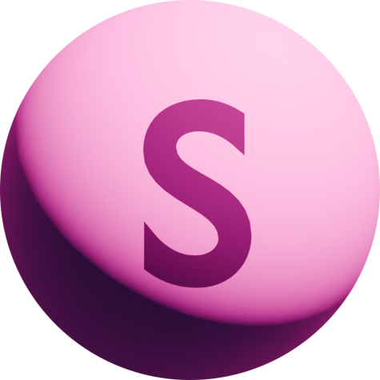

<p align="center">
  
</p>

<h1 align="center">Sphaire</h1>

<p align="center">
  Open-source, browser-native, AI-assisted parametric CAD.
</p>

<p align="center">
  <a href="LICENSE"></a>
  <a href="package.json"></a>
  <a href="https://dev.opencascade.org/"></a>
  <a href="https://webassembly.org/"></a>
</p>

Sphaire is a 3D design studio that runs its geometry engine in the browser. Describe a
part in plain English, start from a primitive, or import an existing model; then edit,
inspect, materialize, validate, and export it from one workspace.

Unlike image-only 3D generation, Sphaire's engineering path produces executable
construction code and real geometry through OpenCascade or Replicad. Babylon.js
renders the scene, deterministic checks review common manufacturability concerns, and
optional AI providers help generate and visually review results.

> [!WARNING]
> Sphaire is experimental engineering software. Always inspect geometry and run the
> appropriate professional checks before manufacturing, especially for structural,
> medical, electrical, automotive, or other safety-critical parts.

## Highlights

| Capability | What it provides |
| --- | --- |
| Text-to-CAD | Natural-language creation with parametric and organic routing |
| Browser CAD kernel | OpenCascade and Replicad running through WebAssembly |
| Direct modeling | Select, move, rotate, scale, resize, and edit mesh components |
| Imports | GLB, GLTF, OBJ, and STL model workflows |
| Materials | Color, metallic/roughness, image textures, and optional AI materials |
| Inspectable code | View and rebuild generated construction code |
| Verification | Geometry validation and FDM, SLA, or CNC-oriented DFM checks |
| Export | Move results into downstream 3D and manufacturing tools |
| Provider choice | Server-configured OpenAI-compatible APIs, BYO key, or local Ollama |

## Quick start

You need Node.js 20 or newer and npm.

```bash
git clone https://github.com/sphaire3d/shaire-web-V2-beta.git
cd shaire-web-V2-beta
npm install
cp .env.example .env.local
npm run dev
```

Open [http://localhost:3000](http://localhost:3000). An API key is optional for manual
modeling, imports, materials, transforms, and exports; AI generation requires either a
configured provider or local Ollama.

## Try these prompts

```text
Create a 24-tooth spur gear.

Create an L-shaped mounting bracket, 60 mm wide and 40 mm tall, with two 5 mm mounting holes.

Create a phone stand with a 70-degree backrest, a 12 mm front lip, and a charging-cable opening.

Create a circular flange with an 80 mm outer diameter, a 30 mm center bore, and six evenly spaced bolt holes.

Create a ventilated electronics enclosure, 100 × 70 × 30 mm, with 2 mm walls and four corner mounting posts.
```

See [Five example prompts](docs/EXAMPLE_PROMPTS.md) for intent, expected behavior, and
iteration tips.

## AI configuration

Choose one of these paths:

1. Put `OPENAI_API_KEY` in `.env.local` to use the server-configured provider.
2. Open **Intelligence settings** and enter an OpenAI-compatible key and base URL. The
   key is stored in that browser and sent only through the selected provider path.
3. Choose **Local · Ollama** to call locally hosted chat, vision, and embedding models.

Optional organic mesh generation uses `REPLICATE_API_TOKEN` and `MESH_GEN_MODEL`.
Without them, Sphaire stays on its parametric path. All supported variables and safe
placeholders live in [`.env.example`](.env.example).

## Self-hosting

### Docker Compose

```bash
cp .env.example .env.local
# Edit .env.local if you want server-side AI features.
docker compose --env-file .env.local up --build
```

Open [http://localhost:3000](http://localhost:3000).

### Docker

```bash
docker build -t sphaire .
docker run --rm -p 3000:3000 --env-file .env.local sphaire
```

### Node.js production server

```bash
npm ci
npm run build
npm start
```

The build scripts copy the required Replicad WebAssembly asset from `node_modules`.
Generated WASM output is intentionally excluded from Git.

## Development commands

```bash
npm run dev        # Local development server
npm run typecheck  # TypeScript validation
npm test           # Supported unit and geometry tests
npm run build      # Optimized production build
npm start          # Serve the production build
```

## How it fits together

```text
Prompt or manual edit
        ↓
Studio state → CAD construction → geometry validation → DFM / visual review
        ↓                                      ↑
Babylon.js viewport ← editable mesh/result ← correction loop
        ↓
Export or continue editing
```

The detailed, code-linked architecture diagram is in
[ARCHITECTURE.md](ARCHITECTURE.md).

## Project documentation

- [Architecture](ARCHITECTURE.md)
- [Example prompts](docs/EXAMPLE_PROMPTS.md)
- [Public roadmap](ROADMAP.md)
- [Contributing](CONTRIBUTING.md)
- [Security policy](SECURITY.md)

## Project status

Sphaire is in active development. The current focus is predictable creation,
selection/editing reliability, import fidelity, safe provider behavior, and trustworthy
exports. See the [public roadmap](ROADMAP.md) before relying on a planned capability.

## Open source means open

Sphaire is released under the [MIT License](LICENSE). You may use it personally or
commercially, copy it, modify it, fork it, redistribute it, include it in another
product, or sell software built with it. You do not need to ask permission.

The license requires preserving the MIT copyright and permission notice in copies or
substantial portions of the software. The software is provided without warranty.

## Contributing

Bug reports, documentation, CAD recipes, fabrication profiles, provider integrations,
accessibility improvements, and pull requests are welcome. Start with
[CONTRIBUTING.md](CONTRIBUTING.md). Please report vulnerabilities privately according
to [SECURITY.md](SECURITY.md).

## License

[MIT](LICENSE) © 2026 Sphaire contributors.
